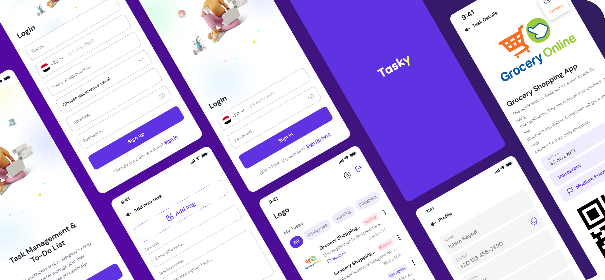

# Tasky

<div align="center">
  
</div>

A Flutter TODO app that allows users to store task data both in the cloud and locally. Tasky offers features such as task priority setting, task progress tracking, and supports Clean Architecture principles with GetIt for dependency injection.

## Features

- Local and cloud task storage
- Task priorities: Low, Medium, High
- Task progress tracking: Waiting, In Progress, Finished
- Built using clean architecture with separation of concerns

## Getting Started

To run this project, you need to ensure your environment is properly set up.

### Requirements

- Dart SDK: `>=3.5.4 <4.0.0`
- Flutter: Any stable version compatible with the above Dart SDK

### Installation and Setup Instructions

1. Clone the repository:
   ```bash
   git clone https://github.com/youssefmsaber/tasky.git
   ```
2. Navigate into the project directory:
   ```bash
   cd tasky
   ```
3. Install dependencies:
   ```bash
   flutter pub get
   ```
4. Configure local and cloud storage (if applicable).
5. Run the app:
    ```bash
   flutter run
   ```
    
## Dependencies

### Core Dependencies

- **dio**: `^5.7.0` - HTTP client for making API requests
- **bloc**: `^8.1.4` - Business Logic Component (BLoC) for state management
- **flutter_bloc**: `^8.1.6` - Flutter integration for BLoC pattern
- **intl**: `^0.19.0` - Internationalization support for formatting dates, numbers, etc.
- **sqflite**: `^2.4.0` - SQLite plugin for local database storage
- **shared_preferences**: `^2.3.2` - Local key-value storage for storing simple data

### Utilities

- **get_it**: `^8.0.2` - Dependency injection for better app structure
- **path_provider**: `^2.1.5` - Access to commonly used device directories like documents or temporary folders
- **json_annotation**: `^4.9.0` - Annotations for JSON serialization/deserialization
- **hydrated_bloc**: `^9.1.5` - State persistence using hydrated BLoC
- **flutter_launcher_icons**: `^0.14.1` - Automatically generate launcher icons for Android and iOS
- **data_connection_checker_nulls**: `^0.0.2` - Check network connectivity in Flutter

### UI Libraries

- **cupertino_icons**: `^1.0.8` - Icons used in Cupertino (iOS-style) apps
- **iconly**: `^1.0.1` - A custom icon library for modern and minimalist icons
- **hexcolor**: `^3.0.1` - Convert hex color codes into Flutter-compatible color objects
- **chip_list**: `^3.1.0` - Chip widget with customizable features
- **qr_flutter**: `^4.1.0` - Generate QR codes for Flutter applications
- **flutter_svg**: `^2.0.12` - Render SVG images in Flutter
- **flutter_svg_icons**: `^0.0.1+4` - Predefined SVG icons for Flutter
- **google_fonts**: `^6.2.1` - Easy access to Google Fonts
- **fade_shimmer**: `^2.2.0` - Shimmer effect for loading UI components
- **flutter_staggered_animations**: `^1.1.1` - Easily implement staggered animations for list and grid views

### Phone Utilities

- **intl_phone_number_input**: `^0.7.4` - Input field for international phone numbers with formatting and validation
- **libphonenumber_plugin**: `^0.3.3` - Utility for validating and formatting phone numbers

### Animations

- **animations**: `^2.0.11` - A collection of pre-built animations provided by Flutter

### Dev Dependencies

- **flutter_test**: Flutter's test framework for writing unit and widget tests
- **flutter_lints**: `^5.0.0` - Standard linting rules for Flutter development
- **json_serializable**: `^6.8.0` - Automatically generate JSON serialization code
- **build_runner**: `^2.4.13` - Code generation tool used alongside `json_serializable`

- ## Architecture

Tasky is built using **Clean Architecture**, ensuring separation of concerns and maintainability. The project is divided into distinct layers:

1. **Domain Layer**: This contains the business logic and core entities. It is independent of external libraries and frameworks, making it highly reusable and testable.
   
2. **Data Layer**: This handles the app’s data sources. It interacts with external APIs, databases (local and cloud), and repositories. The repository pattern is used to abstract and decouple data sources from the rest of the app.

3. **Presentation Layer**: This is where the user interface (UI) and user interaction logic live. The **BLoC (Business Logic Component)** pattern is used for state management, ensuring a clear separation between business logic and UI code. 

4. **Dependency Injection**: The app uses **GetIt** for dependency injection. All the dependencies are registered at the start of the app, ensuring loose coupling between classes.

## Features

Tasky offers several core features:

- **Task Creation and Editing**: Users can create new tasks and edit existing ones.
  
- **Task Priorities**: Tasks can be assigned one of three priorities—Low, Medium, or High—allowing users to manage their task urgency.

- **Task Progress Tracking**: Track the status of tasks with progress states: Waiting, In Progress, or Finished.
  
- **Data Persistence**: Tasks are stored both locally using SQLite (via **sqflite**) and in the cloud, enabling data persistence across sessions and devices.

## How to Run Tests

This project comes with unit and widget tests to ensure correctness.

1. To run the tests, use the following command:
   ```bash
   flutter test
   ```
2. Ensure that you have set up the environment correctly before running the tests. For testing JSON serialization or database interactions, you may need mock data or services.

## Contributing
We welcome contributions to Tasky! If you'd like to contribute, follow these steps:
1. Fork the repository to your own GitHub account.
2. Create a feature branch for your changes:
    ```bash
    git checkout -b feature/my-feature
    ```
3. Make your changes, and ensure that the code follows best practices.
4. Test your changes thoroughly.
5. Commit and push your changes:
   ```bash
   git commit -m "Add new feature"
   git push origin feature/my-feature
   ```
6. Create a pull request from your branch to the main repository.
Please make sure to update tests if necessary, and adhere to the existing architecture and coding style.

## License
This project is licensed under the MIT License. You can check out the license file in the repository for more details.
